# InventorySystem — Sequence Flow Blueprint (by User / Role)

> **Audience:** Developers, QA, and solution engineers who need to understand *who does what, in what order, and which backend classes fire* for every screen in the platform.
> **Companion docs:** `DEVELOPER_ARCHITECTURE.md` (class-level map, multi-module backend), `DATABASE_GUIDE.md` (schema story), `USER_GUIDE.md` (operator onboarding).
> **Diagram syntax:** Mermaid `sequenceDiagram` blocks (render in GitHub / VS Code / Cursor preview).

---

## Table of contents

1. [Roles & personas](#1-roles--personas)
2. [Sidebar option configuration & subroute matrix](#2-sidebar-option-configuration--subroute-matrix)
3. [Cross-cutting request pipeline (every authenticated call)](#3-cross-cutting-request-pipeline)
4. [Module 0 — Identity & session](#4-module-0--identity--session) (includes Super Admin impersonation §4.1a)
5. [Module I — Inbound operations](#5-module-i--inbound-operations)
6. [Module II — Outbound operations](#6-module-ii--outbound-operations)
7. [Module III — Inventory control](#7-module-iii--inventory-control)
8. [Module IV — Manufacturing operations](#8-module-iv--manufacturing-operations)
9. [Module V — Field operations](#9-module-v--field-operations)
10. [Module VI — Admin & intel](#10-module-vi--admin--intel)
11. [Module VII — External portals (B2B & supplier)](#11-module-vii--external-portals)
12. [Offline-first mutation queue & conflict parking](#12-offline-first-mutation-queue--conflict-parking)
13. [Support copilot (optional module)](#13-support-copilot-optional-module)
14. [End-to-end multi-page onboarding tour](#14-end-to-end-multi-page-onboarding-tour)
15. [Role × flow coverage matrix](#15-role--flow-coverage-matrix)
16. [High-level role journeys (at a glance)](#16-high-level-role-journeys-at-a-glance)

---

## 1. Roles & personas

Every flow below is anchored to a Spring `ROLE_*` and the physical surface where that person works.

| Role | Persona | Surface | Typical flows |
|------|---------|---------|---------------|
| `OWNER` | Business owner / founder | Office (Surface A) | Everything + fintech, billing, settings, invoices |
| `ADMIN` | System administrator | Office (Surface A) | Users, suppliers, settings, reports, integrations |
| `WAREHOUSE_MANAGER` | Operations manager | Office (Surface A) | PO/SO lifecycle, allocation, waves, variance approval, RTLS |
| `PICKER` | Floor operator with scanner | Floor (Surface B) | Scan pick/receive, cycle counts, replenishments, exceptions, terminal |
| `VIEWER` | Read-mostly analyst | Office (Surface A) | Dashboards, products, lot trace (read-only) |
| `B2B_CUSTOMER` | Wholesale buyer | Showroom portal | Browse catalog, place portal orders |
| `SUPPLIER` | Vendor contact | Public tokenized portal | View/acknowledge PO, update ship dates |
| `SUPER_ADMIN` *(platform)* | InvSys operator | **Control plane** (`admin.invsys.com` / `:3002`) | Tiers, entitlements, billing, impersonate, suspend, RAG ingest, kill-switch, audit, shards, DLQ, telemetry, compliance — **not** in WMS nav |

Frontend mirrors these with `useSessionStore.hasRole`, `ProtectedRoute`, and the `NAV_MATRIX` filters (`roles`, `hideForPicker`, `hideForViewer`). Exclusive `PICKER` users land on `/fulfillment` (floor shell) instead of the office dashboard.

---

## 2. Sidebar option configuration & subroute matrix

The office rail (`frontends/apps/frontend_wms/src/components/layout/navConfig.ts` + `Sidebar.tsx`) is a **nested category matrix**: one solo item plus six collapsible parent groups. Every parent and leaf icon is unique (Lucide). Categories expand/collapse locally; on viewports ≤1023px the rail becomes a mobile drawer.

> **Control plane:** Super Admin Day-2 ops live in `frontends/apps/frontend_admin` (not this sidebar) and talk to `invsys-admin-api` on `:8081`. WMS data-plane edge blocks `/api/v1/control-plane/**`. The only WMS touch is login `?impersonateToken=` → `POST /api/v1/auth/impersonation/accept`.
>
> **Retail POS:** Cashiers use `frontends/apps/frontend_pos` (`:3003`). Tender writes Dexie `outbox_receipts` immediately. When online, `POST /api/v1/pos/sync-receipts` (`invsys-pos-api`, `@RequireModule(RETAIL_POS)`) enqueues negative `inventory_level_deltas` for the existing flush worker.

| Group | Parent icon | Leaf (route) | Leaf icon | Visible to |
|-------|-------------|--------------|-----------|------------|
| *(solo)* | `LayoutDashboard` | Dashboard (`/dashboard`) | — | All office roles |
| **Inbound** | `DownloadCloud` | Purchase Orders (`/purchase-orders`) | `FileSpreadsheet` | Office roles (not picker) |
| | | Suppliers (`/suppliers`) | `Factory` | Office roles (not picker) |
| | | Mesh Network (`/mesh-network`) | `Network` | OWNER, ADMIN (`MESH_NETWORK`) |
| | | Returns (`/returns`) | `RotateCcw` | OWNER, ADMIN, WAREHOUSE_MANAGER |
| **Outbound** | `UploadCloud` | Sales Orders (`/sales-orders`) | `ShoppingCart` | Office roles (not picker) |
| | | Customers (`/customers`) | `Users` | Office roles (not picker) |
| | | Invoices (`/invoices`) | `DollarSign` | Office roles (not picker) |
| | | Fulfillment (`/fulfillment`) | `Scan` | OWNER, ADMIN, WM, PICKER |
| **Inventory** | `Package` | Products (`/products`) | `Layers` | All office roles |
| | | Replenishments (`/replenishments`) | `ArrowDownUp` | OWNER, ADMIN, WM, PICKER |
| | | Cycle counts (`/cycle-counts`) | `ClipboardCheck` | OWNER, ADMIN, WM, PICKER |
| | | Exceptions (`/exceptions`) | `AlertTriangle` | OWNER, ADMIN, WM |
| | | Lot Trace (`/compliance/lot-trace`) | `GitCommit` | All roles incl. VIEWER |
| **Manufacturing** | `Component` | BOMs (`/manufacturing/boms`) | `Cog` | OWNER, ADMIN, WM |
| | | Production Orders (`/manufacturing/orders`) | `ListOrdered` | OWNER, ADMIN, WM |
| **Field** | `MapPin` | Issue Supplies (`/issue-supplies`) | `HardDrive` | OWNER, ADMIN, WM, PICKER |
| | | Technician Truck (`/field/truck`) | `Truck` | OWNER, ADMIN, WM, PICKER |
| **Admin** | `Settings` | Reports (`/reports`) | `BarChart3` | OWNER, ADMIN |
| | | RTLS map (`/rtls`) | `Compass` | OWNER, ADMIN, WM |
| | | Organization (`/settings`) | `SlidersHorizontal` | OWNER, ADMIN |

**Routes deliberately *not* on the rail:**

- `/import` — reached via the **Import** button on Products (also direct URL).
- `/inbound/receive`, `/manufacturing/terminal`, `/returns/receive` — Surface B floor routes rendered inside `WarehouseFloorShell` (no corporate sidebar, glove-friendly hit targets, PIN idle lock).
- `/settings/fintech` — OWNER-only, linked from Organization settings.
- `/showroom/*` and `/supplier-portal/po/:token` — external portal layouts.

**Tour anchors** live on key leaves (`nav-purchase-orders`, `nav-sales-orders`, `nav-products`) so the driver.js tours can highlight expanded menu entries. E2E helpers `expandNavCategory` / `clickNavLink` (`e2e/fixtures/nav.ts`) mirror the grouping.

---

## 3. Cross-cutting request pipeline

Every sequence diagram below implicitly runs through this pipeline. It is shown once here so the per-module diagrams can stay focused on business logic.

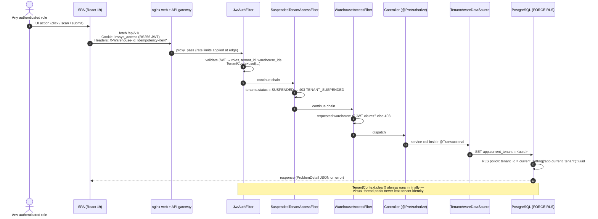

Key invariants:

- **JWTs never touch JavaScript** — HttpOnly cookies only; `apiClient` auto-refreshes on 401.
- **Idempotency-Key is mandatory** on `/fulfillment/scan`; replays return the cached response.
- **Side effects go through the outbox** (`OutboxEvent` → `OutboxDispatcher` → EasyPost / QBO / Shopify / mesh handlers), never inline in the request transaction.

---

## 4. Module 0 — Identity & session

### 4.1 Login → session → shell (all office roles)

The role decides the landing surface: exclusive `PICKER`s go to `/fulfillment` (Surface B), everyone else to `/dashboard` (Surface A).

```mermaid
sequenceDiagram
    autonumber
    actor U as User (any role)
    participant Login as LoginPage
    participant Auth as AuthController / AuthService
    participant Jwt as JwtService (RS256)
    participant DB as PostgreSQL
    participant Shell as AppShell / WarehouseFloorShell

    U->>Login: email only (identifier-first)
    Login->>Auth: GET /api/v1/auth/discovery?email=…
    Auth-->>Login: tenantId, ssoType, ssoUrl, isPasswordAllowed, companyName
    alt SSO enforced
        Login->>U: window.location → ssoUrl (SAML/OIDC)
    else SSO optional
        Login->>U: Sign in with company SSO + password alternative
        U->>Login: password or SSO button
        Login->>Auth: POST /api/v1/auth/login (password path)
    else no SSO
        U->>Login: password (or magic link)
        Login->>Auth: POST /api/v1/auth/login
    end
    Auth->>DB: verify BCrypt hash, load roles + warehouse assignments
    Auth->>Jwt: createAccessToken (roles, tenant_id, warehouse_ids)
    Auth->>DB: persist hashed RefreshToken (rotating, ~7d)
    Auth-->>Login: 200 + Set-Cookie invsys_access (~15m) / invsys_refresh
    Login->>Login: useSessionStore.setSessionFromLogin(user, roles)
    alt exclusive PICKER
        Login->>Shell: navigate /fulfillment (WarehouseFloorShell)
    else office role
        Login->>Shell: navigate /dashboard (AppShell)
    end
    Shell->>Auth: GET /api/v1/auth/me → applyMeProfile
    Shell->>Shell: load warehouses; WarehouseContextGate (SSID / geofence lock)
    Shell->>Shell: Sidebar renders NAV_MATRIX filtered by hasRole / hideForPicker / hideForViewer
```

### 4.1a Super Admin impersonation (God Mode)

Platform operators never share a WMS password. Impersonation mints a 15-minute WMS JWT (`token_type=IMPERSONATION`) signed with the **same** RS256 PEMs as `invsys-app`.

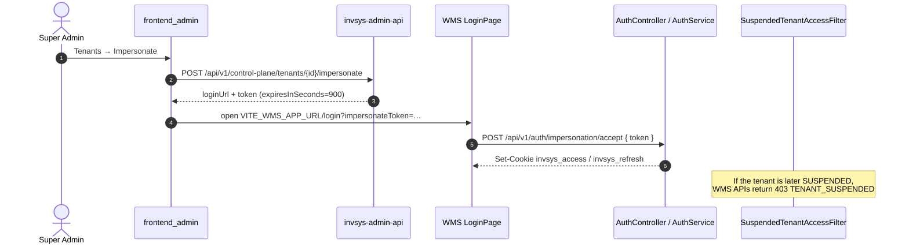

### 4.2 Floor PIN lock (PICKER on shared scanner)

Floor routes (`isFloorRoute`: `/fulfillment`, `/inbound`, `/cycle-counts`, `/manufacturing/terminal`, `/returns/receive`, `/issue-supplies`, `/replenishments`, `/field`) enforce a shift PIN + idle lock. The AES key for the offline vault lives only in RAM (`useCryptoMemoryKeyStore`).

```mermaid
sequenceDiagram
    autonumber
    actor P as Picker
    participant Lock as ScannerLockScreen
    participant Store as useScannerLockStore
    participant Vault as offline/pinVault (IndexedDB verifier)
    participant Redis as RedisPinLockoutService

    P->>Lock: enters 4-digit shift PIN
    Lock->>Store: tryUnlock(pin)
    Store->>Vault: derive key + compare verifier
    alt PIN correct
        Vault-->>Store: AES key → useCryptoMemoryKeyStore (RAM only)
        Store-->>Lock: unlocked → floor UI interactive
    else PIN wrong (repeated)
        Store->>Redis: increment lockout counter (server-side on auth paths)
        Redis-->>Lock: brute-force guard → cooldown message
    end
    Note over Store: Idle timer re-locks; wipe clears vault + key.<br/>E2E hook: window.__INVSYS_SCANNER_LOCK__.tryUnlock(pin)<br/>(unlocks without clearing an active tour)
```

---

## 5. Module I — Inbound operations

### 5.1 Purchase Orders (`/purchase-orders`) — WAREHOUSE_MANAGER

**Role activities:** an office manager drafts and submits POs against approved suppliers; landed cost (freight/customs) is distributed across unit valuations.
**Cross-role correlation:** the submitted PO becomes the baseline contract that the floor scanner matches when freight arrives (§5.3).
**Backend hooks:** `PurchaseOrderService`, `LandedCostService`, `CrossTenantMeshBridgeService`; PO submit appends an `OutboxEvent` (async mesh CONFIRMED SO / EDI). `POST /purchase-orders/{id}/confirm` submits then synchronously creates an **UNALLOCATED** seller SO when the supplier is a `CONNECTED` mesh partner, and appends `Linked to Mesh Partner Sales Order #SO-…` on the PO.

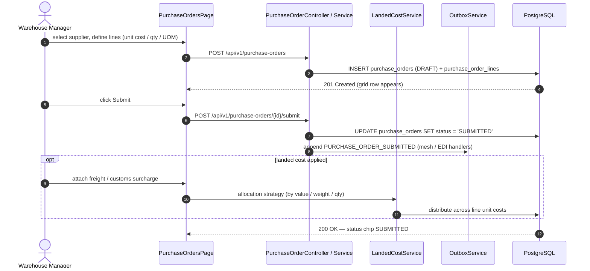

PO status machine: `DRAFT → SUBMITTED → IN_TRANSIT → PARTIALLY_RECEIVED → RECEIVED`.

### 5.2 Suppliers (`/suppliers`) — ADMIN / OWNER

**Role activities:** maintain vendor master data — payment terms, quality ratings, default lead times, banking details.
**Cross-role correlation:** lead-time variables feed the automated replenishment engines; banking data is envelope-encrypted before persistence.
**Backend hooks:** `SupplierRepository` (RLS-scoped), `CredentialVaultService` (`ENV1` envelope; `LOCAL` / `AWS_KMS` / `HASHICORP_VAULT`).

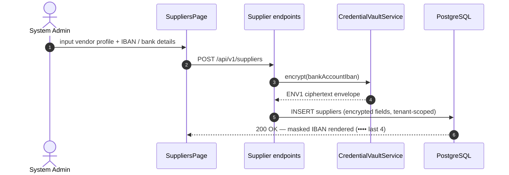

### 5.3 Floor receive (`/inbound/receive`) — PICKER (with GS1 + putaway)

**Role activities:** the picker opens receive from a PO (or the manager's "Floor receive" hand-off), scans PO → product barcode → destination bin, and confirms putaway.
**Cross-role correlation:** the ledger `RECEIVE` write is what unlocks sellable ATP for office allocation and the B2B portal.
**Backend hooks:** `FulfillmentController.executeScan` (receive branch), `ScanService` + `Gs1BarcodeParser`, `PurchaseOrderService.receiveLine`, `InventoryService.receive`, `PutAwaySuggestionService`.

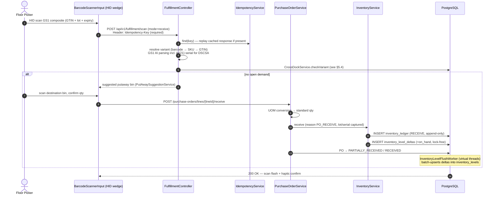

### 5.4 Cross-dock intercept — PICKER × WAREHOUSE_MANAGER (Track 13)

When inbound stock matches an **open backordered SO**, the engine bypasses deep-storage putaway and routes the unit straight to the staging lane.

```mermaid
sequenceDiagram
    autonumber
    actor Mgr as Warehouse Manager (office)
    actor Picker as Floor Picker (mobile)
    participant SO as SalesOrderService
    participant XD as CrossDockService
    participant F as FulfillmentController
    participant POS as PurchaseOrderService
    participant DB as PostgreSQL

    Mgr->>SO: confirm + allocate SO with 0 on-hand
    SO->>DB: sales_orders → BACKORDERED (qtyAllocated = 0)
    Mgr->>POS: create + submit PO for the same variant
    Picker->>F: receive-mode HID scan of the product
    F->>XD: checkVariant(variant, warehouse)
    XD->>DB: rank open BACKORDERED demand (jOOQ, priority 0 first)
    XD-->>Picker: CrossDockOverlay — "go to Z-SHIP/S-01"<br/>(NOT the normal putaway bin)
    Picker->>F: HID scan staging barcode S-01 (UI confirm only)
    Picker->>POS: receive PO line
    POS->>POS: location forced → staging, reason CROSS_DOCK_ROUTING
    POS->>DB: inventory_ledger RECEIVE @ staging + CROSS_DOCK_ROUTING
    POS->>XD: fulfillOpenDemand
    XD->>DB: allocation → CROSS_DOCK_ROUTED; SO → ALLOCATED
    DB-->>Mgr: TanStack Query refetch — BACKORDERED chip flips to ALLOCATED
```

### 5.5 Returns / RMA (`/returns` office + `/returns/receive` floor)

**Roles:** office manager approves the RMA; picker receives and dispositions on the floor.
**Backend hook:** `ReturnService` (quarantine-aware).

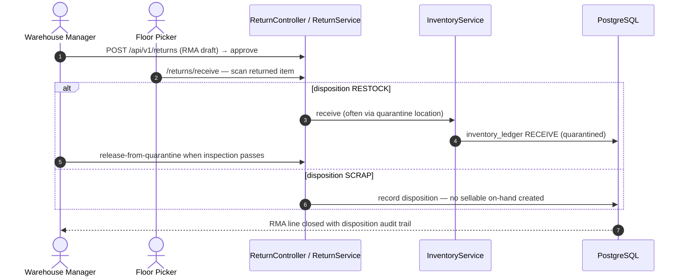

### 5.6 Mesh Network hub (`/mesh-network`) — OWNER / ADMIN (`MESH_NETWORK`)

**Role activities:** discover products published by other tenants (name / image / seller only), request a connection, approve incoming requests, and publish your own SKUs with a mesh wholesale price.
**Cross-role correlation:** Approve auto-creates a **Supplier** in the buyer tenant and a **Customer** in the seller tenant, then marks `tenant_mesh_partners` `CONNECTED`. A later PO against that supplier becomes the seller’s sales order (§5.1). The dashboard **Smart sourcing** card (`GET /api/v1/dashboard/mesh-sourcing-suggestions`) offers **Draft PO** when on-hand is below `BinReplenishmentRule.minQuantity` and a connected partner publishes the same SKU or barcode.
**Backend hooks:** `MeshCatalogController`, `MeshCatalogService`, `CrossTenantMeshBridgeService`, `BootstrapJdbc` (RLS-bypass pairing writes). Settings → Partner Catalog (`/api/v1/settings/mesh/**`) still maps local variants to partner SKUs.

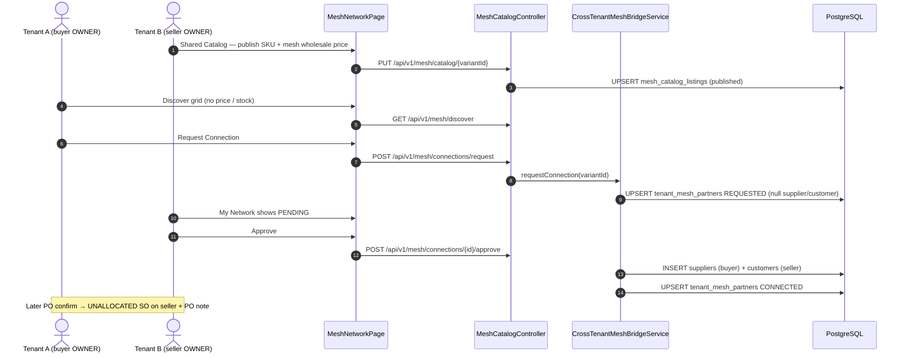

Handshake statuses: buyer sees **REQUESTED**; seller sees the same row as **PENDING**; both see **CONNECTED** after approve. Discover never returns `meshWholesalePrice`, stock, or unpublished listings.

---

## 6. Module II — Outbound operations

### 6.1 Sales Orders (`/sales-orders`) — clerk / WAREHOUSE_MANAGER

**Role activities:** create orders manually or receive demand via Shopify / EDI webhooks; confirm then allocate.
**Cross-role correlation:** allocation reserves physical stock (FEFO lots) that "Generate Wave" turns into pick tasks for the PICKER.
**Backend hooks:** `SalesOrderService`, `AllocationService`, `KitService` (hard kits), `SoftKitExplosionService` (soft kits explode at create).

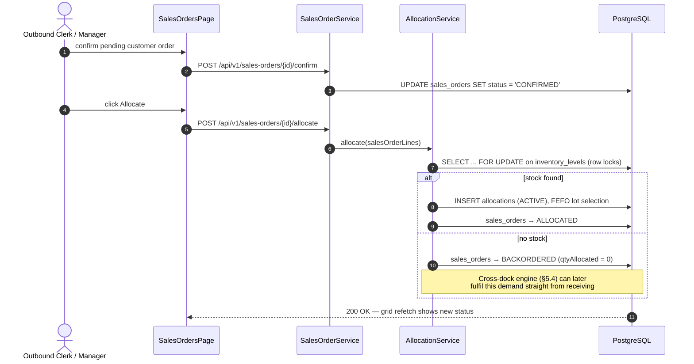

SO status machine: `DRAFT → CONFIRMED → (ALLOCATED | BACKORDERED | NEEDS_REVIEW) → PARTIALLY_SHIPPED → SHIPPED → CLOSED`; any open state → `CANCELLED` (releases allocations).

### 6.2 Wave picking → ship — WAREHOUSE_MANAGER × PICKER

**Backend hooks:** `PickingWaveService` (generate / optimize / release), `PickingService` (hierarchical location-path sort + A* wayfinding), `TaskInterleavingService` (next-best-action), `ShipmentService` (+ EasyPost labels via outbox), `CartonizationEngine` (First-Fit Decreasing 3D preview).

```mermaid
sequenceDiagram
    autonumber
    actor Mgr as Warehouse Manager
    actor Picker as Floor Picker
    participant Wave as PickingWaveService
    participant F as FulfillmentController
    participant Inv as InventoryService
    participant Ship as ShipmentService
    participant OB as OutboxService → EasyPost
    participant DB as PostgreSQL

    Mgr->>Wave: generate wave from ALLOCATED orders
    Wave->>DB: create picking_waves / batches / tasks (toteIdentifier for MIB)
    Mgr->>Wave: optimize (hierarchical path sort) + release
    Picker->>F: claim batch → scan pick (mode=pick, Idempotency-Key)
    F->>F: assertPickable (right SKU, right task)
    F->>Inv: adjust(-qty) reason SCAN_PICK
    Inv->>DB: inventory_ledger + allocation consumeForPick
    Note over Picker,F: TaskInterleavingService may inject the closest<br/>COUNT / PUTAWAY task before the next pick
    Picker->>Ship: pack station — cartonize preview + digital scale<br/>(stable Web Serial/BT reading auto-triggers pack-label)
    Ship->>Inv: ship (consume allocations; optional lpnBarcode bulk ship)
    Inv->>DB: inventory_ledger SHIP
    Ship->>OB: SALES_ORDER_SHIPPED → EasyPostLabelHandler prints label
    DB-->>Mgr: SO → SHIPPED / PARTIALLY_SHIPPED (dashboard SSE updates)
```

### 6.3 Customers & credit (`/customers`) — accounts / ADMIN

**Cross-role correlation:** if an SO exceeds the customer's available credit, allocation freezes the line into a credit-hold state — the clerk sees it immediately.
**Backend hook:** `CreditService` (exact `BigDecimal` monetary math).

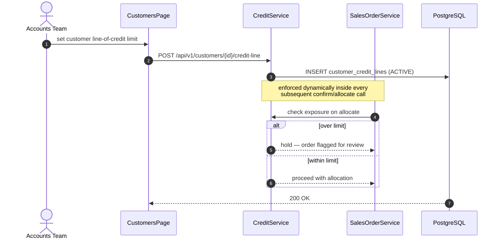

### 6.4 Invoices (`/invoices`) — OWNER (+ Stripe webhook)

**Cross-role correlation:** a paid invoice releases stock for shipment; the dashboard updates live over SSE — no polling.
**Backend hooks:** `InvoicingService`, `PublicWebhookController` + Stripe signature validator + `WebhookReplayDriftFilter` (300s timestamp window), `DashboardSseHub`.

```mermaid
sequenceDiagram
    autonumber
    actor Owner as Business Owner
    participant Stripe as Stripe (external)
    participant Hook as PublicWebhookController
    participant Drift as WebhookReplayDriftFilter
    participant Inv as InvoicingService
    participant SSE as DashboardSseHub
    participant UI as InvoicesPage / Dashboard
    participant DB as PostgreSQL

    Owner->>UI: review AR aging; optionally send payment request email
    Stripe->>Hook: payment_intent.succeeded (signed)
    Hook->>Drift: signature + timestamp drift check (>300s → 401)
    Drift->>Inv: process event
    Inv->>DB: UPDATE invoices SET status = 'PAID'
    Inv->>DB: INSERT outbox_events (INVOICE_PAID → accounting sync QBO/Xero)
    Inv->>SSE: broadcast("INVOICE_PAID", payload)
    SSE-->>UI: text/event-stream push — invoice row turns green live
```

---

## 7. Module III — Inventory control

### 7.1 Products (`/products`) — catalog manager / all office roles

**Role activities:** define variants, dimensions, packaging, temperature zones; browse via a responsive virtualized grid.
**Cross-role correlation:** dimensions feed cartonization previews (§6.2); on-hand shown here is maintained by the delta flush worker — the grid is a *view*, the ledger is the truth.
**Backend hooks:** variant catalog services + `InventoryLevelFlushWorker` (drains `inventory_level_deltas`).

```mermaid
sequenceDiagram
    autonumber
    actor Mgr as Inventory Manager
    participant UI as ProductsPage (VirtualizedTable / ProductMobileCards)
    participant Grid as useGridColumnStore
    participant Worker as InventoryLevelFlushWorker
    participant DB as PostgreSQL

    Mgr->>UI: adjust item master (dimensions, temp zone, UOM)
    UI->>DB: PATCH product_variants
    Note over UI,DB: floor scans meanwhile append ledger rows →<br/>inventory_level_deltas (lock-free)
    Worker->>DB: SELECT pending deltas (virtual threads)
    Worker->>DB: batch atomic flush → inventory_levels
    DB-->>UI: TanStack Query refetch — accurate on_hand / allocated / ATP
    opt layout personalization (client-only)
        Mgr->>Grid: Show all / Ops only preset, pin, hide, reorder
        Grid-->>UI: recomputed column widths (pinned sku+name stay frozen;<br/>only non-sticky columns flex-grow — no blank canyon)
    end
```

Responsive behavior (client-side, no server round-trip):

| Viewport | Rendering |
|----------|-----------|
| Desktop ≥1024px | Full `VirtualizedTable`, sticky `sku`+`name`, horizontal scroll for overflow |
| Tablet 768–1023px | Sheds compliance columns (`TABLET_SHED_COLUMN_IDS`); `minRowPx ≥ 48` touch targets |
| Mobile <768px | Table unmounts → `ProductMobileCards` virtualized card stack |

### 7.2 Cycle Counts (`/cycle-counts`) — PICKER × WAREHOUSE_MANAGER

**Role activities:** picker performs **blind** counts on the scanner; manager adjudicates variances from the office.
**Backend hook:** `CycleCountService` with programmatic variance policy (auto-approve small deltas, escalate big ones).

```mermaid
sequenceDiagram
    autonumber
    actor Picker as Floor Picker
    actor Mgr as Warehouse Manager
    participant UI as Scanner UI / Office review board
    participant CC as CycleCountService
    participant DB as PostgreSQL

    Picker->>UI: input blind physical bin count (no expected qty shown)
    UI->>CC: POST /api/v1/fulfillment/scan (mode=count)
    CC->>DB: evaluate variance against snapshot
    alt |variance| exceeds MaxAutoAdjustValue
        CC->>DB: cycle_count_lines → PENDING_MANAGER_REVIEW (slot locked)
        Mgr->>UI: review variance queue → Approve Adjustment
        UI->>CC: office approve endpoint
        CC->>DB: INSERT inventory_ledger (ADJUST, manager-attributed)
    else match or low-impact delta
        CC->>DB: INSERT inventory_ledger (ADJUST, auto-approved)
    end
    DB-->>UI: count line closed; levels reconciled via delta flush
```

### 7.3 Replenishments (`/replenishments`) — material handler (PICKER role)

**Backend hooks:** `ReplenishmentService` (min/max bin rules) + `PredictiveReplenishmentWorker` (48h demand vs pick-face qty → `wave_replenishment_triggers`).

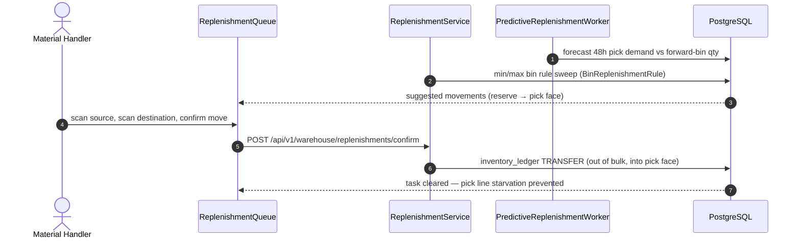

### 7.4 Exceptions / Skip & Flag (`/exceptions`) — PICKER × WAREHOUSE_MANAGER

**Cross-role correlation:** flagging frees the bound allocations *without* writing a ledger adjustment, so accounting stays clean while outbound reroutes.
**Backend hook:** `FulfillmentExceptionService`.

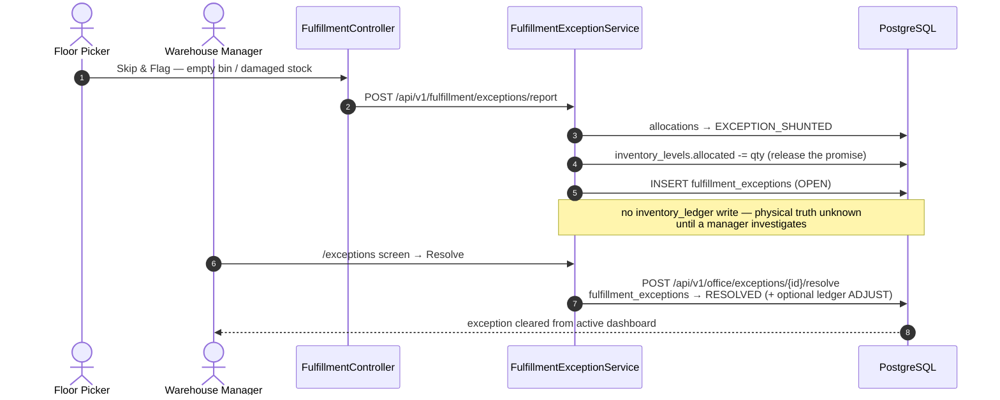

### 7.5 Lot Trace (`/compliance/lot-trace`) — compliance auditor (any role incl. VIEWER)

**Backend hook:** `InventoryGenealogyService` — recursive parent/child ledger queries (FSMA §204 lot metadata, DSCSA serials).

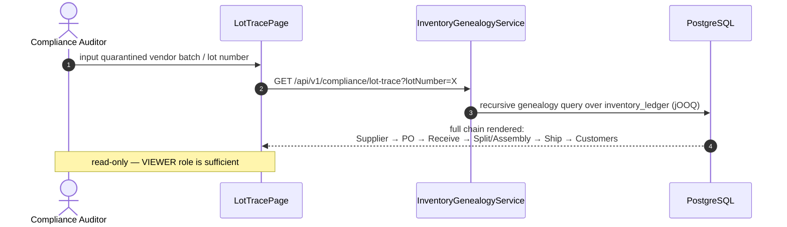

### 7.6 RTLS map (`/rtls`) — WAREHOUSE_MANAGER (Admin group)

**Backend hooks:** `SpatialMapService` (coordinates, 7-day heatmap, walkable edges), `DashboardSseHub` (live positions), `rtls_tags` / `rtls_position_events` (V084).

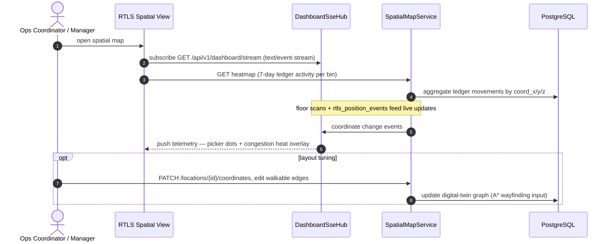

---

## 8. Module IV — Manufacturing operations

### 8.1 BOMs (`/manufacturing/boms`) — production engineer (WM/ADMIN)

**Backend hook:** `ManufacturingService` (components, operations, co-products / byproduct outputs).

```mermaid
sequenceDiagram
    autonumber
    actor Eng as Production Engineer
    participant UI as ManufacturingBomsPage
    participant Mfg as ManufacturingService
    participant DB as PostgreSQL

    Eng->>UI: create finished-SKU assembly recipe
    UI->>Mfg: POST /api/v1/manufacturing/boms
    Mfg->>DB: INSERT boms + bom_lines + bom_operations + bom_outputs
    DB-->>UI: 200 OK — recipe registered
    Note over Mfg,DB: BOM drives component availability math<br/>when a production order launches (§8.2)
```

### 8.2 Production Orders (`/manufacturing/orders`) — planner (WM)

**Cross-role correlation:** allocating components locks raw materials so standard sales picks cannot consume them.

```mermaid
sequenceDiagram
    autonumber
    actor Plan as Production Planner
    participant UI as ManufacturingOrdersPage
    participant Mfg as ManufacturingService
    participant DB as PostgreSQL

    Plan->>UI: schedule work order run
    UI->>Mfg: POST /api/v1/production-orders
    Mfg->>DB: INSERT production_orders (DRAFT)
    Plan->>UI: click Allocate Components
    UI->>Mfg: POST /api/v1/production-orders/{id}/allocate
    Mfg->>DB: SELECT ... FOR UPDATE raw component levels
    Mfg->>DB: production_orders → COMPONENTS_ALLOCATED
    DB-->>UI: components greenlit for assembly
```

### 8.3 Production Terminal (`/manufacturing/terminal`) — machine operator (floor route)

**Backend hooks:** `ManufacturingLaborService` (timesheets × labor rates), `ManufacturingService.assemble` (consume components, mint finished goods).

```mermaid
sequenceDiagram
    autonumber
    actor Op as Machine Operator
    participant UI as ProductionTerminalPage (floor shell)
    participant Labor as ManufacturingLaborService
    participant Mfg as ManufacturingService
    participant DB as PostgreSQL

    Op->>UI: scan work-order barcode → Start
    UI->>Labor: POST /manufacturing/terminal/timesheet/start
    Labor->>DB: INSERT production_timesheets (active)
    Op->>UI: complete assembly run
    UI->>Labor: POST /manufacturing/terminal/timesheet/stop
    Labor->>DB: duration × TeamLaborRate → labor cost on the order
    UI->>Mfg: POST /api/v1/production-orders/assemble
    Mfg->>DB: inventory_ledger ASSEMBLY (consume raw components)
    Mfg->>DB: inventory_ledger ASSEMBLY (receive finished goods)
    Mfg->>DB: production_orders → COMPLETED
    DB-->>UI: finished-goods labels print automatically (ZPL)
```

---

## 9. Module V — Field operations

### 9.1 Issue Supplies (`/issue-supplies`) — toolroom attendant

**Cross-role correlation:** internal consumption deducts stockroom volume against a cost center *without* creating a customer sales order.
**Backend hook:** `InternalConsumptionService`.

```mermaid
sequenceDiagram
    autonumber
    actor Att as Toolroom Attendant
    participant UI as IssueSuppliesPage
    participant IC as InternalConsumptionService
    participant DB as PostgreSQL

    Att->>UI: select target cost center, scan supply SKU
    UI->>IC: issue-supplies confirm endpoint
    IC->>DB: validate cost-center budget clearance
    IC->>DB: INSERT inventory_ledger (ADJUST: internal consumption)
    DB-->>UI: 200 OK — stockroom qty deducted, cost center charged
```

### 9.2 Technician Truck (`/field/truck`) — field service engineer

**Cross-role correlation:** van stock is a `VEHICLE` location; consumption below reorder point signals the depot for automated truck replenishment.
**Backend hook:** `FieldFulfillmentService` + `VehicleAssignment`.

```mermaid
sequenceDiagram
    autonumber
    actor Tech as Field Technician
    participant UI as TechnicianTruckPage (mobile)
    participant Field as FieldFulfillmentService
    participant DB as PostgreSQL

    Tech->>UI: scan component consumed on-site
    UI->>Field: POST /api/v1/field/consume
    Field->>DB: INSERT inventory_ledger (ADJUST from VEHICLE location)
    Note over Field,DB: reorder-point check flags the van<br/>for depot replenishment when low
    DB-->>UI: 200 OK — van stock synchronized
    Note over Tech,UI: offline-first — scans queue in IndexedDB<br/>and replay when connectivity returns (§12)
```

---

## 10. Module VI — Admin & intel

### 10.1 Reports (`/reports`) — OWNER / ADMIN

**Backend hooks:** `ReportingAnalyticsService` (jOOQ window queries), `DashboardKpiService` (CQRS `dashboard_kpi_snapshots` read model for `/dashboard/stats`).

```mermaid
sequenceDiagram
    autonumber
    actor Exec as Executive (OWNER/ADMIN)
    participant UI as ReportsPage
    participant An as ReportingAnalyticsService
    participant DB as PostgreSQL

    Exec->>UI: open Profit / COGS analysis board
    UI->>An: GET /api/v1/reports/financials
    An->>DB: multi-tenant window queries (jOOQ, RLS-scoped)
    DB-->>UI: hydrate Recharts dashboards
    Note over An,DB: dashboard headline KPIs come from the CQRS<br/>snapshot table, not live aggregation (V075)
```

### 10.2 Organization settings (`/settings`) — OWNER / ADMIN

**Cross-role correlation:** global tenant rules (blind receiving, adjustment limits, scanner options) instantly govern all floor behavior; every alteration is trigger-audited.
**Backend hooks:** `SettingsController` → `TenantSettings` (JSON), append-only `audit_log` trigger (V085), `AuditLogArchivalWorker` (cold S3 archive).

```mermaid
sequenceDiagram
    autonumber
    actor Owner as Account Owner
    participant UI as SettingsPage
    participant Set as SettingsController
    participant DB as PostgreSQL

    Owner->>UI: toggle global rule (e.g. enable Blind Receiving)
    UI->>Set: PATCH /api/v1/settings
    Set->>DB: UPDATE tenant_settings (JSON preferences)
    DB->>DB: trigger → INSERT audit_log (actor + JSON diff, partitioned)
    DB-->>UI: 200 OK — rule live for every floor scanner immediately
    Note over DB: aged audit rows cold-archive to S3/MinIO as gzip JSONL;<br/>purge only after confirmed 2xx upload
```

---

## 11. Module VII — External portals

### 11.1 B2B Showroom (`/showroom/*`) — B2B_CUSTOMER

**Backend hook:** `PortalService` (catalog restrictions, customer-specific price lists, volume breaks).

```mermaid
sequenceDiagram
    autonumber
    actor Buyer as B2B Customer
    participant Portal as ShowroomLayout
    participant P as PortalController / PortalService
    participant SO as SalesOrderService
    participant DB as PostgreSQL

    Buyer->>Portal: login (B2B_CUSTOMER role → showroom-only routes)
    Portal->>P: GET catalog (restricted to customer's allowed products)
    P->>DB: price lists + VolumePriceBreak resolution
    Buyer->>Portal: build cart → place order
    Portal->>SO: create sales order (portal channel)
    SO->>DB: INSERT sales_orders (DRAFT, source=PORTAL)
    Note over SO,DB: office clerk confirms/allocates via §6.1 —<br/>the portal buyer only sees status updates
    DB-->>Portal: order confirmation + live status
```

### 11.2 Supplier portal (`/supplier-portal/po/:token`) — SUPPLIER (tokenized, public ingress)

```mermaid
sequenceDiagram
    autonumber
    actor Sup as Supplier Contact
    participant Pub as PublicSupplierPortalController
    participant DB as PostgreSQL

    Sup->>Pub: open tokenized PO link (no tenant login)
    Pub->>DB: resolve token → scoped PO view (BootstrapJdbc where needed)
    Sup->>Pub: acknowledge PO / update promised ship date
    Pub->>DB: update PO acknowledgment fields + audit
    DB-->>Sup: confirmation — office PO grid reflects the ack
```

---

## 12. Offline-first mutation queue & conflict parking

Applies to every floor persona (PICKER, technician). Failed *business* rules while replaying offline work never block the operator — they park as conflicts for the office. Parking attaches hybrid `schema_metadata_json` field descriptors so managers correct values in a glove-friendly form (never raw JSON). Approve & Re-process stamps the ledger as the manager with reason `OFFLINE_CONFLICT_OVERRIDE`.

```mermaid
sequenceDiagram
    autonumber
    actor Picker as Floor Picker (offline)
    participant UI as Scanner UI
    participant IDB as IndexedDB mutationQueue
    participant API as Spring API
    participant GEH as GlobalExceptionHandler
    participant Con as OfflineSyncConflictService
    participant Inv as InventoryService
    actor Office as Office Manager

    Picker->>UI: scan while network is down
    UI->>UI: bufferMisScan (5s undo window)
    UI->>IDB: enqueueMutation (payload + Idempotency-Key)
    Note over IDB: TanStack Query offlineFirst — UI stays optimistic
    IDB->>API: startMutationQueueReplay() when online<br/>Header: X-Offline-Replay: 1
    alt success
        API-->>UI: 200 — cache invalidated, levels reconcile
    else business rule violation (409/422)
        API->>GEH: ApiException
        GEH->>Con: sink + schema_metadata_json (mutable/immutable fields)
        GEH-->>UI: HTTP 202 { conflictId } (not an error toast)
        Office->>Con: SyncConflictsPanel — human summary + dynamic form
        alt Discard Transaction
            Con-->>Office: status DISCARDED
        else Approve & Re-process
            Office->>Con: resolveConflict(manualCorrections)
            Con->>Inv: adjust(... reason OFFLINE_CONFLICT_OVERRIDE)<br/>created_by = manager
            Con-->>Office: status RESOLVED_AND_REPLAYED
        end
    end
```

---

## 13. Support copilot (optional module)

Support Co-Pilot, training simulator, and onboarding-tour hosts are an **optional** product surface:

| Layer | Gate |
|-------|------|
| Maven | `invsys-chatbot` on `invsys-app` via profile **`with-chatbot`** (active by default). Omit with `-P"!with-chatbot"`. |
| Spring | `invsys.features.chatbot.enabled` (`INVSYS_CHATBOT_ENABLED`) — `matchIfMissing=true`. When `false`, `ChatbotAutoConfiguration` does not load; `/api/v1/support/**` returns **404** (still requires auth — no security bypass). |
| React | Optional package at `frontends/apps/frontend_wms/src/modules/chatbot`. Core imports only `@/lib/chatbot/active` (real or stub via `npm run chatbot:enable|disable`). Also `VITE_ENABLE_CHATBOT` / `isChatbotEnabled()`. Deleting the module folder still compiles. |

When enabled, the floating `support-assistant-fab` is available on both surfaces. Answers are **role-aware**: a PICKER asking "how do I receive?" gets scanner-first steps, never desktop PO creation. CQRS tools (`checkOrderStatus`, `getLedgerHistorySummary`, `checkAvailableToPromise`) read tenant id **only** from `TenantContext`.

```mermaid
sequenceDiagram
    autonumber
    actor User as Any role
    participant FAB as SupportAssistantWidget (lazy)
    participant Chat as SupportChatService (invsys-chatbot)
    participant Tools as SupportCopilotReadService
    participant Ctx as TenantContext
    participant Vec as pgvector (support_knowledge_chunks, HNSW)
    participant Graph as GraphRAG (support_knowledge_nodes/edges)

    Note over FAB: Mounted only if isChatbotEnabled()
    User->>FAB: ask question (current route + role attached)
    FAB->>Chat: POST /api/v1/support/chat (authenticated)
    opt LLM tool call
        Chat->>Tools: checkOrderStatus / ATP / ledger summary
        Tools->>Ctx: requireTenantId() — never trust LLM tenant args
        Tools-->>Chat: grounded facts
    end
    Chat->>Vec: embed query → similarity search filtered by audience (role)
    Chat->>Graph: expand related nodes/edges for multi-hop context
    Chat-->>FAB: grounded answer + action chips / Action Draft / proactive insight
    Note over Vec,Graph: knowledge corpus is GLOBAL (no tenant RLS) —<br/>never store tenant ledger data or PII in it
```

**Core-only regression:** `CoreModuleWithoutChatbotIT` boots with chatbot disabled and still completes receive → allocate → pick → ship. Playwright: `tests/e2e/decoupled-module.spec.ts`.

---

## 14. End-to-end multi-page onboarding tour

> **Requires chatbot UI enabled.** `OnboardingTourHost` and `TourOrchestrator` mount only when `isChatbotEnabled()` is true (same flag as the Support FAB). With `VITE_ENABLE_CHATBOT=false` (or runtime `__INVSYS_CHATBOT__=false`), tours do not run; warehouse flows are unaffected.

The `receiving-to-allocation` tour (`frontends/apps/frontend_wms/src/features/support/tourSteps.ts`) is a **6-step, 3-page** guided journey that mirrors the physical heartbeat of the warehouse: *Purchase Order → Bin → Sales Order*. It is driven by driver.js v1.8 plus a Zustand tour machine in `usePreferencesStore`:

| Store field | Purpose |
|-------------|---------|
| `activeTourId` | `'office' \| 'floor' \| 'receiving-to-allocation' \| null` |
| `currentTourStep` | Global step index (0–5), survives route hops (persisted) |
| `isTourMovingRoutes` | Gate flag while a cross-page transition is in flight |
| `targetRoute` | Pathname the orchestrator waits for before resuming |
| `transitionToSubpage(route, nextStep)` | Destroys the live driver instance, sets the gate + target, bumps the step |
| `clearTour()` | Full flush on finish/dismiss |

Step map (global indices):

| # | Route | Anchor selector | Popover | Button |
|---|-------|-----------------|---------|--------|
| 0 | `/purchase-orders` | `[data-tour="tour-po-grid"]` | Inbound purchase orders | Next |
| 1 | `/purchase-orders` | `[data-tour="tour-po-receive-cta"]` | Hand off to the floor | Next → **transition** to `/inbound/receive?po=PO-2026-00001`, resume at 2 |
| 2 | `/inbound/receive` | `[data-tour="inbound-receive"]` | Warehouse receive shell | Next |
| 3 | `/inbound/receive` | `[data-tour="tour-inbound-scanner"]` | GS1 / barcode wedge | Next → **transition** to `/sales-orders`, resume at 4 |
| 4 | `/sales-orders` | `[data-tour="tour-so-allocation"]` | Outbound allocation | Next |
| 5 | `/sales-orders` | `[data-testid="support-assistant-fab"]` | You are ready | **Finish Onboarding** |

```mermaid
sequenceDiagram
    autonumber
    actor User as New user (office role)
    participant Router as React Router (useLocation)
    participant Orch as TourOrchestrator
    participant Driver as driver.js instance
    participant Store as usePreferencesStore (Zustand)
    participant Lock as useScannerLockStore
    participant API as Backend

    User->>Store: startTour('receiving-to-allocation')
    Note over Store: activeTourId set, currentTourStep = 0

    rect rgb(240, 246, 255)
    Note over User,API: Phase 1 — Inbound procurement (/purchase-orders, steps 1–2 of 6)
    Orch->>Driver: mount single-step driver — highlight PO grid<br/>showProgress: "Step 1 of 6"
    User->>Driver: Next → handleAdvance → setTourStep(1)
    Orch->>Driver: highlight "Floor receive" CTA — "Step 2 of 6"
    User->>Driver: Next (transition step)
    Driver->>Store: transitionToSubpage('/inbound/receive', 2)<br/>→ destroyActiveTourDriver() FIRST (prevents unmounted-anchor crash)<br/>→ isTourMovingRoutes = true, targetRoute set
    Orch->>Router: navigate('/inbound/receive?po=PO-2026-00001')
    end

    rect rgb(240, 255, 244)
    Note over User,API: Phase 2 — Floor receive (/inbound/receive, steps 3–4 of 6)
    Router->>Orch: useLocation fires — pathname === targetRoute && isTourMovingRoutes
    opt floor PIN lock intercepts
        Lock-->>User: PIN screen (floor route)
        User->>Lock: tryUnlock(pin) — tour state is preserved, not cleared
    end
    Orch->>Orch: requestAnimationFrame loop — wait until<br/>'[data-tour="inbound-receive"]' exists in DOM
    Orch->>Store: clearRouteTransition()
    Orch->>Driver: re-mount at currentTourStep = 2 — "Step 3 of 6"
    User->>Driver: Next → "Step 4 of 6" (GS1 wedge anchor)
    User->>API: (optional live demo) scan posts ledger RECEIVE
    User->>Driver: Next (transition step)
    Driver->>Store: transitionToSubpage('/sales-orders', 4) — destroy + gate
    Orch->>Router: navigate('/sales-orders')
    end

    rect rgb(255, 248, 240)
    Note over User,API: Phase 3 — Outbound allocation (/sales-orders, steps 5–6 of 6)
    Router->>Orch: pathname match → rAF anchor wait → resume at step 4
    Orch->>Driver: highlight allocation header — "Step 5 of 6"
    User->>Driver: Next → "Step 6 of 6" (copilot FAB, doneBtnText "Finish Onboarding")
    User->>Driver: click Finish Onboarding
    Driver->>Store: handleFinish → driver.destroy() → clearTour()
    Note over Store: activeTourId = null, step = 0, gates cleared —<br/>next tour run starts fresh with correct counters
    end
```

### Step-by-step mechanics breakdown

**Phase 1 — Inbound procurement (`/purchase-orders`)**

- `TourOrchestrator` mounts a *single-step* driver per global step (not one driver for all six) — this is what makes cross-page teardown safe. Progress text is computed from the global index: `Step {{current}} of {{total}}` renders "Step 1 of 6" even though the driver instance holds one step.
- On a transition step, `onNextClick` is intercepted: `transitionToSubpage` runs `destroyActiveTourDriver()` **before** any navigation, so driver.js never holds a reference to a DOM anchor that React is about to unmount. Only then does the orchestrator call `navigate(...)` with the deep-link href (including the `?po=` query).

**Phase 2 — Warehouse floor receive (`/inbound/receive`)**

- The route lands inside `WarehouseFloorShell`. If the shift PIN lock is active, unlocking via `useScannerLockStore.tryUnlock` does **not** clear tour state — the E2E hook `window.__INVSYS_SCANNER_LOCK__.tryUnlock(pin)` exists precisely so tests can unlock without resetting the machine.
- Resumption is DOM-safe: the orchestrator polls with `requestAnimationFrame` until the step's anchor selector resolves, then calls `clearRouteTransition()` and re-mounts the driver at `currentTourStep = 2`. The step counter continues at "Step 3 of 6" — no reset.

**Phase 3 — Outbound allocation (`/sales-orders`)**

- The final card anchors on the support copilot FAB and swaps the button to **Finish Onboarding**. `handleFinish` (unlike `handleAdvance`) does not set the retain flag, so `onDestroyed` proceeds to `clearTour()` — every field (`activeTourId`, `currentTourStep`, `isTourMovingRoutes`, `targetRoute`) is flushed. Dismissing mid-tour (X button) takes the same cleanup path, guaranteeing subsequent runs never inherit stale counters.
- Persistence note: the tour machine lives in the persisted `preferencesStore` slice, so a hard refresh mid-transition resumes correctly; legacy persisted keys (`isTourAwaitingRoute`, `awaitingRoute`) are migrated by the store's `merge` function.

**E2E coverage:** `e2e/support-multipage-tour.spec.ts` asserts route hops via `page.waitForURL`, waits on `driver-popover` overlay nodes, verifies the step counter increments 1→6 without resets, and uses `unlockFloorPreservingTour` for the PIN gate.

---

## 15. Role × flow coverage matrix

Quick index of which sections each role appears in:

| Role | Primary flows |
|------|---------------|
| `OWNER` | Login §4.1 · Invoices §6.4 · Reports §10.1 · Settings §10.2 · Fintech (`/settings/fintech`) · Mesh Network §5.6 |
| `ADMIN` | Login §4.1 · Suppliers §5.2 · Customers/credit §6.3 · Reports §10.1 · Settings §10.2 · Mesh Network §5.6 |
| `WAREHOUSE_MANAGER` | PO lifecycle §5.1 · Cross-dock (office side) §5.4 · Returns approve §5.5 · SO confirm/allocate §6.1 · Waves §6.2 · Variance approval §7.2 · Exceptions resolve §7.4 · RTLS §7.6 · Manufacturing §8.1–8.2 |
| `PICKER` | Floor PIN §4.2 · Floor receive §5.3 · Cross-dock (floor side) §5.4 · Returns receive §5.5 · Pick/ship §6.2 · Blind counts §7.2 · Replenishments §7.3 · Skip & Flag §7.4 · Terminal §8.3 · Issue supplies §9.1 · Truck §9.2 · Offline queue §12 |
| `VIEWER` | Login §4.1 · Products (read) §7.1 · Lot trace §7.5 |
| `B2B_CUSTOMER` | Showroom §11.1 |
| `SUPPLIER` | Supplier portal §11.2 |
| `SUPER_ADMIN` | Control plane (separate app) · Impersonation §4.1a · Tenant suspend / billing / RAG / kill-switch / audit / shards / DLQ |
| *All roles* | Request pipeline §3 · Copilot §13 *(when chatbot module enabled)* · Onboarding tour §14 *(same gate)* |

---

## 16. High-level role journeys (at a glance)

The diagrams in §4–§14 are *per-screen* and name specific controllers and services. This section zooms out: **one diagram per role**, showing a typical shift/day as a sequence of activities against the platform, with the *correlated activities of other roles* shown as they naturally interleave. No backend class names here — just people, surfaces, and hand-offs. Section references point to the detailed diagram for each hop.

### 16.1 OWNER — run the business

Activities: money in (invoices), money out (PO spend), health checks (reports), global rules (settings). Correlated: managers and clerks generate the orders the owner monitors; Stripe pays the invoices.

```mermaid
sequenceDiagram
    autonumber
    actor Owner as OWNER
    participant App as InventorySystem (office)
    actor Mgr as Warehouse Manager
    participant Ext as Stripe / QBO (external)

    Owner->>App: log in → land on /dashboard (§4.1)
    App-->>Owner: live KPIs over SSE (orders, AR, exceptions)
    opt MESH_NETWORK entitled
        Owner->>App: Mesh Network discover / approve (§5.6)
        App-->>Owner: Smart sourcing card when a partner has a low SKU
    end
    Owner->>App: review Reports — profit / COGS / turns (§10.1)
    Owner->>App: review Invoices & AR aging (§6.4)
    Ext-->>App: Stripe webhook — invoice PAID (§6.4)
    App-->>Owner: invoice row flips green live (SSE)
    Owner->>App: adjust org settings — e.g. blind receiving (§10.2)
    App-->>Mgr: new rule governs every floor scanner immediately
    Note over Owner,Mgr: correlation — owner sets policy; manager & pickers<br/>operate under it the same minute (audit-logged)
```

### 16.2 ADMIN — keep the system healthy

Activities: user/role management, supplier master data, customer credit, integrations. Correlated: the master data admins maintain is what every other role transacts against.

```mermaid
sequenceDiagram
    autonumber
    actor Admin as ADMIN
    participant App as InventorySystem (office)
    actor Mgr as Warehouse Manager
    actor Fin as Accounts / clerks

    Admin->>App: log in → /dashboard (§4.1)
    Admin->>App: create / deactivate users, assign roles & warehouses
    App-->>Admin: NAV_MATRIX + LBAC now scope what each user sees (§2, §3)
    Admin->>App: maintain Suppliers — terms, lead times, banking (§5.2)
    App-->>Mgr: approved suppliers become selectable on new POs (§5.1)
    Fin->>App: set customer credit limits (§6.3)
    App-->>Fin: future SO allocations auto-enforce the limit
    Admin->>App: review Reports & audit trail (§10.1–10.2)
    Note over Admin,Fin: correlation — admin-owned master data (vendors,<br/>users, credit) silently gates every downstream flow
```

### 16.3 WAREHOUSE_MANAGER — orchestrate the flow

Activities: buy stock, promise stock, release work, adjudicate exceptions. Correlated: nearly everything the manager does creates or consumes work for the picker.

```mermaid
sequenceDiagram
    autonumber
    actor Mgr as WAREHOUSE_MANAGER
    participant App as InventorySystem (office)
    actor Picker as Floor Picker
    actor Sup as Supplier

    Mgr->>App: log in → /dashboard (§4.1)
    Mgr->>App: draft + submit Purchase Orders (§5.1)
    App-->>Sup: PO visible on tokenized supplier portal (§11.2)
    Sup-->>App: acknowledge PO / promised ship date
    Mgr->>App: confirm + allocate Sales Orders (§6.1)
    Mgr->>App: generate → optimize → release picking wave (§6.2)
    App-->>Picker: pick tasks appear on scanner
    Picker-->>App: Skip & Flag exception — empty bin (§7.4)
    Mgr->>App: resolve exception / approve count variance (§7.2, §7.4)
    Picker-->>App: freight received against PO (§5.3)
    App-->>Mgr: PO chips flip RECEIVED; backorders may cross-dock (§5.4)
    Note over Mgr,Picker: correlation — manager promises (allocate/release),<br/>picker executes (scan), exceptions flow back up for judgment
```

### 16.4 PICKER — execute on the floor

Activities: everything scan-first inside the floor shell (PIN-locked, offline-tolerant). Correlated: office decisions (waves, POs, RMAs) arrive as tasks; picker scans become the ledger truth the office sees.

```mermaid
sequenceDiagram
    autonumber
    actor Picker as PICKER
    participant Scanner as Floor shell (Surface B)
    participant App as InventorySystem
    actor Mgr as Warehouse Manager (office)

    Picker->>Scanner: log in → land on /fulfillment (§4.1)
    Picker->>Scanner: enter shift PIN — idle lock (§4.2)
    Mgr-->>App: releases wave / submits PO / approves RMA
    App-->>Scanner: tasks appear (picks, receives, counts, moves)
    Picker->>Scanner: receive freight — scan PO → item → bin (§5.3)
    alt open backorder matched
        App-->>Picker: cross-dock overlay — route to staging (§5.4)
    end
    Picker->>Scanner: claim batch → scan picks → pack → ship (§6.2)
    Picker->>Scanner: blind cycle counts between tasks (§7.2)
    Picker->>Scanner: replenish pick faces (§7.3)
    opt problem in the aisle
        Picker->>Scanner: Skip & Flag (§7.4) — keeps moving
        App-->>Mgr: exception queued for office resolution
    end
    opt network drops
        Scanner->>Scanner: scans queue in IndexedDB, replay later (§12)
    end
    Note over Picker,Mgr: correlation — every scan writes the ledger the<br/>office trusts; every office release feeds the scanner queue
```

### 16.5 VIEWER — observe and audit

Activities: read-only analysis and compliance tracing. Correlated: the data viewed is produced entirely by the operational roles above.

```mermaid
sequenceDiagram
    autonumber
    actor Viewer as VIEWER
    participant App as InventorySystem (office, read-only)
    actor Ops as Operational roles (Mgr / Picker)

    Viewer->>App: log in → /dashboard (§4.1)
    App-->>Viewer: KPIs, order statuses (no mutate buttons rendered)
    Viewer->>App: browse Products grid — on-hand / ATP (§7.1)
    Viewer->>App: trace a lot end-to-end (§7.5)
    App-->>Viewer: Supplier → PO → Receive → Assembly → Ship → Customer
    Ops-->>App: meanwhile: scans, allocations, shipments keep writing
    App-->>Viewer: query refetch — numbers stay current
    Note over Viewer,Ops: correlation — viewer consumes the ledger;<br/>server rejects any write attempt (roles + @PreAuthorize)
```

### 16.6 B2B_CUSTOMER — buy through the showroom

Activities: browse a restricted catalog at negotiated prices, place orders, watch status. Correlated: the portal order enters the exact same outbound pipeline as any office-entered SO.

```mermaid
sequenceDiagram
    autonumber
    actor Buyer as B2B_CUSTOMER
    participant Portal as Showroom portal
    participant App as InventorySystem
    actor Clerk as Office clerk / Manager
    actor Picker as Floor Picker

    Buyer->>Portal: log in → showroom-only routes (§11.1)
    Portal-->>Buyer: personal catalog + price list + volume breaks
    Buyer->>Portal: build cart → place order
    Portal->>App: sales order created (DRAFT, source=PORTAL)
    Clerk->>App: confirm + allocate the order (§6.1)
    Picker->>App: pick, pack, ship (§6.2)
    App-->>Buyer: live status — CONFIRMED → ALLOCATED → SHIPPED
    Note over Buyer,Picker: correlation — buyer only sees status chips;<br/>the fulfillment machinery behind them is §6
```

### 16.7 SUPPLIER — acknowledge and deliver

Activities: no tenant login — a tokenized link scopes them to one PO. Correlated: their acknowledgment updates the office grid; their shipment becomes the picker's receiving work.

```mermaid
sequenceDiagram
    autonumber
    actor Sup as SUPPLIER
    participant Portal as Tokenized PO portal
    participant App as InventorySystem
    actor Mgr as Warehouse Manager
    actor Picker as Floor Picker

    Mgr->>App: submit PO (§5.1)
    App-->>Sup: tokenized portal link (no login) (§11.2)
    Sup->>Portal: open link → view PO lines
    Sup->>Portal: acknowledge + set promised ship date
    Portal->>App: ack recorded — office PO grid updates
    Sup-->>Picker: freight physically arrives
    Picker->>App: receive against the PO (§5.3)
    App-->>Mgr: PO → RECEIVED; stock sellable (ATP)
    Note over Sup,Mgr: correlation — supplier promise dates feed lead-time<br/>math for replenishment; receipt closes the loop
```

### 16.8 Cross-role correlation — one unit of stock, end to end

The single most important correlated journey: how one demand signal ripples across five roles. Each hop below is a detailed diagram elsewhere in this doc.

```mermaid
sequenceDiagram
    autonumber
    actor Buyer as B2B Customer
    actor Clerk as Clerk / Manager (office)
    actor Sup as Supplier
    actor Picker as Picker (floor)
    actor Owner as Owner

    Buyer->>Clerk: order placed via showroom (§11.1)
    Clerk->>Clerk: confirm → allocate — no stock → BACKORDERED (§6.1)
    Clerk->>Sup: PO submitted for the missing variant (§5.1)
    Sup->>Sup: acknowledge + ship (§11.2)
    Sup->>Picker: freight arrives at dock
    Picker->>Picker: receive scan — cross-dock intercept fires (§5.4)
    Note over Picker: unit routed straight to staging,<br/>skipping deep storage
    Picker->>Clerk: SO flips BACKORDERED → ALLOCATED automatically
    Clerk->>Picker: wave released → pick / pack / ship (§6.2)
    Picker->>Buyer: carrier label printed, order SHIPPED
    Clerk->>Owner: invoice issued (§6.4)
    Owner->>Owner: Stripe payment lands — dashboard SSE, books sync
    Note over Buyer,Owner: five roles, one ledger — every hop above is<br/>auditable in Lot Trace (§7.5)
```

### 16.9 SUPER_ADMIN — operate the platform (separate app)

Activities happen in `frontend_admin` (`:3002`), never in the WMS sidebar. Correlated: tenant staff keep working until Suspend or a kill-switch lands.

```mermaid
sequenceDiagram
    autonumber
    actor SA as Super Admin
    participant CP as Control plane (:3002 / :8081)
    actor Owner as Tenant OWNER
    participant WMS as Data plane (:3000 / :8080)

    SA->>CP: login as platform_admins (owner@demo.test)
    SA->>CP: change tier / modules on a tenant
    CP-->>WMS: TenantSubscription cache evict → @RequireModule gates
    SA->>CP: Impersonate → 15-min WMS JWT (§4.1a)
    SA->>WMS: support session as that tenant
    SA->>CP: Suspend tenant
    WMS-->>Owner: subsequent APIs 403 TENANT_SUSPENDED
    SA->>CP: kill-switch / DLQ retry / rate-limit slider / compliance broadcast
    Note over SA,WMS: Super Admin cookies are invsys_admin_*;<br/>WMS cookies stay invsys_access / invsys_refresh
```

---

*When runtime behavior and this document disagree, trust the code (`service/`, `tourSteps.ts`, `navConfig.ts`) and update this file.*
